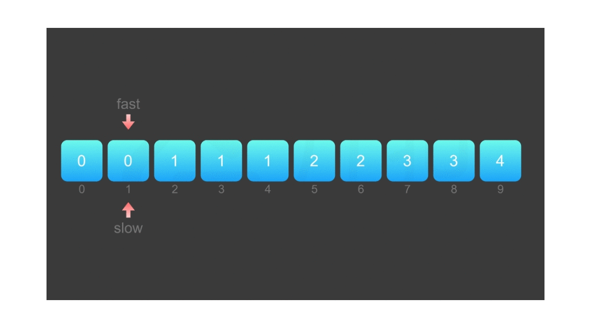
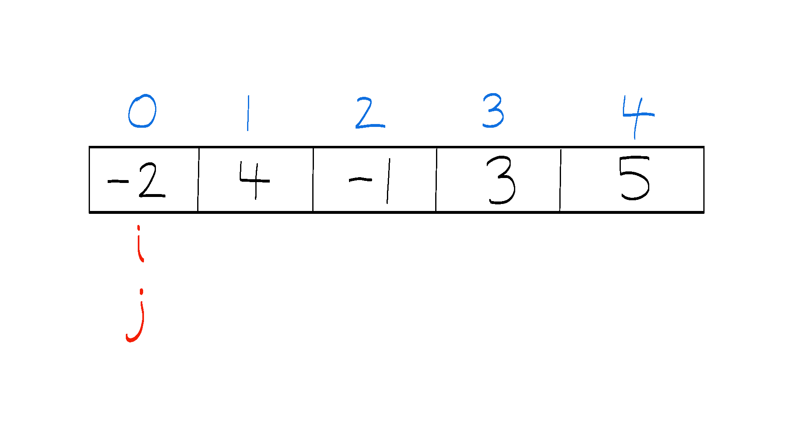

# Topic 2 Two Pointers



The **Two Pointers** technique is a fundamental approach in algorithmic problem-solving, widely used to optimize solutions involving arrays, strings, and other linear data structures. By using two pointers, you can reduce the time complexity of a problem and solve it efficiently. Let's explore how this technique works and when to apply it! 🚀

---

## 📌 What is Two Pointers?



The **Two Pointers** technique uses two pointers or indices to traverse through an array or string. These pointers can either move towards each other or move in the same direction at different speeds. This technique is particularly useful for solving problems related to searching, sorting, and array manipulation.

### Types of Two Pointers:

1. **Opposite Pointers**:
   - One pointer starts at the beginning, and the other starts at the end of the data structure.
   - The pointers move towards each other, often used in problems like finding pairs that sum up to a target value.

2. **Same Direction Pointers**:
   - Both pointers move in the same direction, but at different speeds.
   - This is often used in problems like detecting cycles, finding subarrays, or partitioning arrays.

---

## 💡 Key Idea

The key advantage of the **Two Pointers** technique is its ability to reduce the time complexity of problems from \(O(n^2)\) to \(O(n)\), which makes it much more efficient for large inputs. By adjusting the pointers dynamically, we avoid redundant calculations and improve performance.

The technique typically works by:
- **Comparing** elements from two ends or at different positions.
- **Shifting** the pointers to explore the array or string.
- **Updating** the result based on the current comparison.

---

## 🛠️ How to Apply Two Pointers?

1. **Opposite Pointers**:
   - Place one pointer at the beginning of the array and the other at the end.
   - Move the pointers towards each other while performing comparisons or calculations.

2. **Same Direction Pointers**:
   - Place both pointers at the same starting position.
   - Move the pointers at different speeds, adjusting one pointer based on conditions (e.g., when a certain condition is met, move one pointer ahead while keeping the other at a constant position).

---

## 📝 Example 1: Two Sum (Opposite Pointers) 💡

### Problem:
Find two numbers in a sorted array that add up to a specific target.

### Code:

```dart
List<int> twoSum(List<int> nums, int target) {
  int left = 0;
  int right = nums.length - 1;

  while (left < right) {
    int sum = nums[left] + nums[right];

    if (sum == target) {
      return [left, right]; // Return indices
    } else if (sum < target) {
      left++; // Move left pointer right to increase sum
    } else {
      right--; // Move right pointer left to decrease sum
    }
  }
  return []; // No solution found
}

void main() {
  List<int> nums = [2, 7, 11, 15];
  int target = 9;
  print(twoSum(nums, target)); // Output: [0, 1]
}
```

### Explanation 📝

1. Input: `nums = [2, 7, 11, 15]`, `target = 9`
2. Sliding Window Steps:
   - Start: `nums[0] + nums[3] = 2 + 15 = 17` (move right pointer)
   - Move: `nums[0] + nums[2] = 2 + 11 = 13` (move right pointer)
   - Move: `nums[0] + nums[1] = 2 + 7 = 9` ✅ (found solution)
3. Output: `[0, 1]` (indices of the two numbers that sum to the target)

---

## 📝 Example 2: Longest Substring Without Repeating Characters (Same Direction Pointers) 🔑

### Problem:
Find the length of the longest substring without repeating characters.

### Code:

```dart
int lengthOfLongestSubstring(String s) {
  int maxLength = 0;
  int start = 0;
  Map<String, int> seen = {};

  for (int end = 0; end < s.length; end++) {
    String currentChar = s[end];

    if (seen.containsKey(currentChar)) {
      start = max(start, seen[currentChar]! + 1); // Update start if char repeats
    }

    seen[currentChar] = end; // Update the last seen position
    maxLength = max(maxLength, end - start + 1); // Update max length
  }

  return maxLength;
}

void main() {
  String s = "abcabcbb";
  print(lengthOfLongestSubstring(s)); // Output: 3
}
```

### Explanation 📝

1. Input: `s = "abcabcbb"`
2. Sliding Window Steps:
   - Start: `a` → Length = 1
   - Extend: `ab` → Length = 2
   - Extend: `abc` → Length = **3** ✅
   - Repeat: Move start to skip the first `a`.
   - Final: The longest substring is `abc`, length = `3`.

---

## 🔥 Applications of Two Pointers

1. **Pair Sum Problems** 👫
2. **Palindrome Check** 🔄
3. **Merging Sorted Arrays** ➗
4. **Finding Subarrays/Substrings** 🔍

---

## 🚀 Why Use Two Pointers?

- **Efficiency**: Reduces time complexity from \(O(n^2)\) to \(O(n)\) in many problems.
- **Space Efficient**: Often does not require extra space, making it ideal for in-place algorithms.
- **Intuitive**: Often provides a natural and straightforward approach to problems involving arrays and strings.

---

## 🏁 Conclusion

The **Two Pointers** technique is a highly efficient and versatile approach to solving many algorithmic problems. By using two pointers, you can reduce redundant work and improve performance significantly. Keep practicing and applying this technique to master it! 🎯
